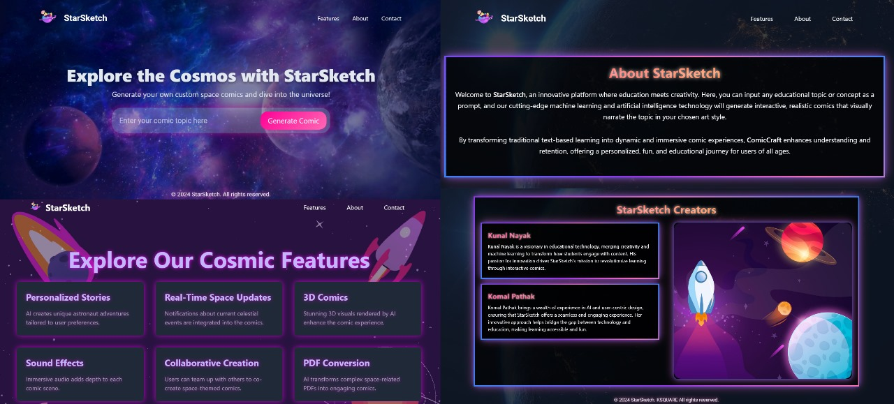

# StarSketch 🌌

Welcome to *StarSketch*—where space and science come alive through interactive comics! 🚀✨

  

## Idea 💡

StarSketch is a web application that merges the wonders of space and science with the creativity of comic storytelling. By using AI and machine learning, we turn educational topics into engaging, interactive comics. The goal is to make learning about complex scientific concepts more fun, accessible, and memorable through visually stunning and immersive narratives. 🎨🌠

## Inspiration ✨

StarSketch was born from the idea of making complex space and science topics more engaging and accessible. By transforming traditional text-based learning into dynamic, visually captivating comic experiences, we aim to ignite curiosity and enhance understanding. 🌌📚

## What It Does 📚

StarSketch leverages machine learning and AI to generate interactive and realistic comics based on space and science prompts. Our platform offers:

- *Personalized Stories*: Unique astronaut adventures tailored to user preferences. 👩‍🚀✨
- *Real-Time Space Updates*: Notifications about current celestial events integrated into the comics. 🌠🔭
- *3D Comics*: Stunning 3D visuals rendered by AI for an immersive experience. 🎨🪐
- *Sound Effects*: Immersive audio that adds depth to each comic scene. 🎧🔊
- *Collaborative Creation*: Team up with others to co-create space-themed comics. 🤝🚀
- *PDF Conversion*: Convert complex space-related PDFs into engaging comics. 📄➡️🖼️
- *Customizable Layouts*: Adjust comic pages and highlight key moments. 🛠️📐

## Technologies Used 🛠️

- *Hugging Face Inference API*: For advanced natural language processing and generating comic narratives. 🧠🔍
- *Large Language Models (LLM)*: To generate engaging and coherent comic stories. 🗣️📖
- *Natural Language Models (NLM)*: For understanding and processing user prompts. 🧠💬
- *Generative AI*: Creating realistic and interactive comic panels. 🤖🖼️
- *Flask*: For developing the backend of our web application. 🕵️‍♂️🔧
- *Django*: Used for robust web framework support and development. 🌐🛠️
- *Jupyter Notebook*: For experimentation and data analysis during development. 📊🔬
- *Mkistral AI*: To enhance AI-driven comic generation capabilities. 🧠✨
- *LoRA*: For optimizing and fine-tuning model performance. 🚀🔧

## How We Built It 🛠️

- *AI and Machine Learning*: Advanced algorithms to create personalized and visually appealing comic narratives. 🤖🖋️
- *Artistic Styles*: Various styles to cater to different user preferences. 🎨🖌️
- *Interactive Elements*: Real-time updates and 3D visuals for enhanced engagement. ⚙️🌌
- *User Collaboration*: Tools for co-creating and customizing comics. 🧩🤝

## Challenges We Ran Into 🚧

- *Complexity of AI Training*: Ensuring the AI produces coherent and high-quality comic panels. 🧠🔍
- *Artistic Diversity*: Maintaining quality across various artistic styles. 🎨💼
- *User Customization*: Balancing customization options with AI-generated content. ⚖️🛠️

## Accomplishments We're Proud Of 🏆

- *Innovative AI Use*: Harnessing AI to create educational and interactive comics. 🤖📚
- *Enhanced Engagement*: Transforming traditional learning into dynamic, visually engaging formats. 🌟📖
- *Personalization*: Tailoring comic experiences to individual preferences and learning styles. ✨👤

## What We Learned 🧠

- *AI Precision*: The importance of fine-tuning AI to meet user expectations and educational goals. ⚙️🔍
- *User Engagement*: Interactive formats significantly boost user engagement and knowledge retention. 🚀🧩
- *Feedback Integration*: Continuous feedback is key to refining features and improving the user experience. 💬🔄

## What's Next for StarSketch 🚀

- *Content Expansion*: Adding more topics and themes for a broader range of subjects. 📚🌌
- *Enhanced Personalization*: Improving AI algorithms for even more personalized experiences. 🤖🔧
- *Community Features*: Developing tools for collaborative creation and sharing of space-themed comics. 🌐🤝
- *Monetization*: Exploring premium features, exclusive content, and merchandise. 💸🛍️

## Demo Video 🎥

Check out our demo video on YouTube to see StarSketch in action: [Watch the Demo](https://www.youtube.com/watch?v=your-demo-video)  

License 📜 This project is licensed under the MIT License - see the LICENSE file for details.

Contact 📬 For any inquiries, please contact: Kunal Email: kunalnayak3004@gmail.com

Made with ❤️ by RadGov | KSQUARE
